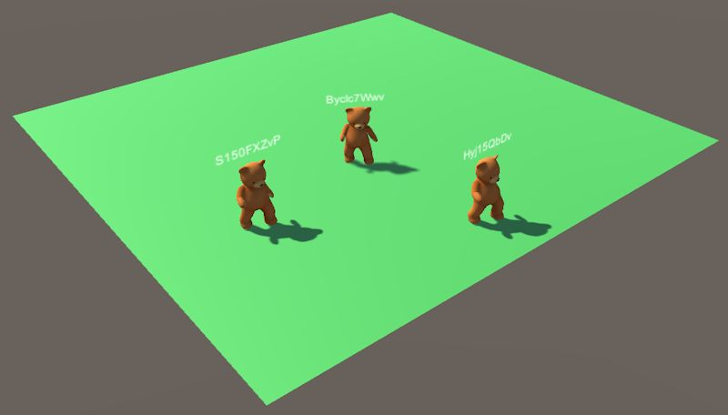

# NodeJS/Unity-NodeJS-Game-GUI
  
This folder contains enhancements to the minimum Client.  
Documentation has been add to explain the modules and scripts used by the Client to 
aid others in enhancing the Client example for developing their own game.  

The Client has been imported to and built with Unity 2019.4.12f1(LTS).  
NOTE: Since the Library is not saved, Unity will import it the first time the Client 
project is loaded. Just close Unity after it builds the Library database and reopen it.  
The random warnings should go away.  
   
Added a Login scene to allow a player to set the Host IP address.  
   
Mod1: Added name over character. Uses socket id as name.  
  
