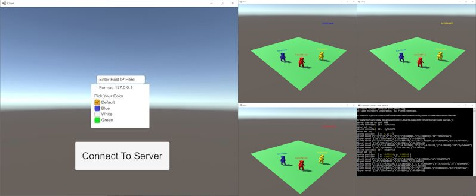

# NodeJS/Unity-NodeJS-Game-MOD1
  
This folder contains enhancements to the minimum Client.  
Documentation has been add to explain the modules and scripts used by the Client to 
aid others in enhancing the Client example for developing their own game.  

The Client has been imported to and built with Unity 2019.4.15f1(LTS).  
Import the Assets.unitypackage from the Client folder.
   
Added a Login scene to allow a player to set the Host IP address and other parameters.  
   
Mod1: Added name over character. Uses socket id as name.  
  
Mod2: Added color select radio buttons to set the name plate color.  
Mod3: Use color select radio buttons to set the color of the avatar.    
